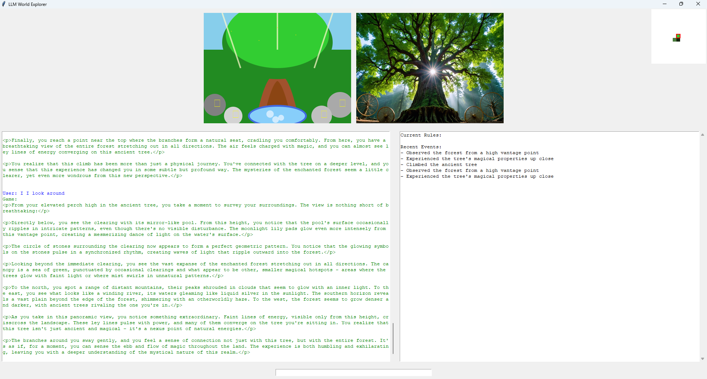
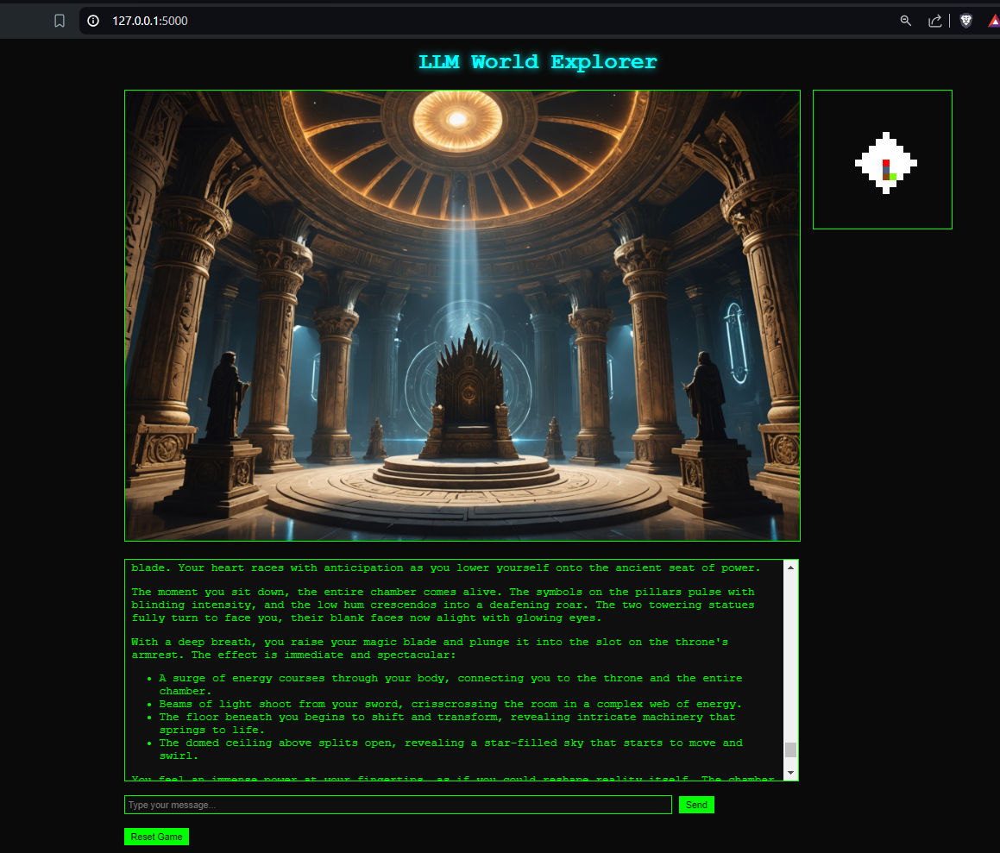

# LLM World
 Visual narrative adventure powered by Claude 3.5

## Instructions
 1) From root dir, run ```pip install -r requirments.txt```
 2) Run ```python -m src.app```
 3) To start a new adventure, delete:
    - ```game_state.json```
    - ```world_map.json```
    - ```world_state.json```

## Novel Ideas
### LLM Anchored Image Generation
By using LLM to output SVG, we provide a logical "grounding" to the scene. This SVG is consistent for the scene, meaning any interactions with the scene will update the SVG, guiding the image generated.



## Examples
### Web App GUI



